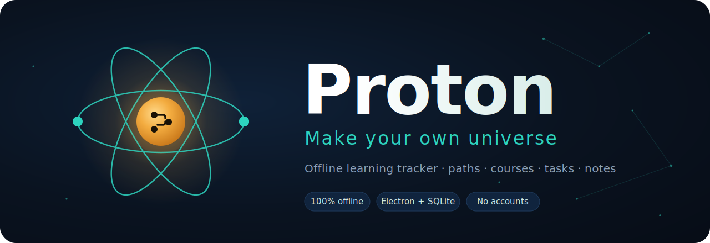

<p align="center">
  
</p>

<h1 align="center">Proton</h1>
<p align="center"><b>Make your own universe.</b><br>
A professional, <b>fully offline</b> Windows learning tracker — paths, courses, tasks, and a rich knowledge base of notes.</p>

<p align="center">
  
  
  
  
</p>

<p align="center">
  <a href="https://github.com/MostafaHazeim25/proton/releases/latest">
    
  </a>
</p>

---

## ⬇️ Download

Grab the latest build from the **[Releases page »](https://github.com/MostafaHazeim25/proton/releases/latest)** and pick one:

| File | What it does |
|------|--------------|
| **`Proton Setup.exe`** | One‑click installer — adds desktop & Start‑menu shortcuts |
| **`Proton Portable.exe`** | Run it directly, no installation needed |

> You don’t need to install anything else — **no Node.js, no internet, no account.** Just Windows 10/11 (64‑bit).

#### First launch
The app isn’t code‑signed, so Windows may show a blue **“Windows protected your PC”** screen the first time. That’s expected for a free, self‑built app:

> Click **More info → Run anyway**.

Your data is stored locally and never leaves your machine.

---

## ✨ What you can do

- **🗂️ Paths & courses** — organize your learning into paths, each holding courses, parts, and tasks.
- **📊 Dashboard** — see overall progress across everything at a glance.
- **🧱 Board** — a Trello‑style To Do / In Progress / Done board; drag cards to update status.
- **⭐ Today** — pin tasks to focus on today and keep a daily streak going.
- **📝 Notes — a real knowledge system** (Notion + Obsidian + XMind style):
  - Full‑page notes bound to **Path → Course → Part**.
  - A block editor: headings, **bold/italic/underline**, bullet/numbered/checklists, quotes, code blocks, callouts, tables, internal note links, and drag‑/paste‑/resizable images & attachments.
  - A **knowledge tree** to browse and create notes.
  - An interactive **mind map** of each course — expand, open, add, and drag notes between parts; pan & zoom.
  - **Global search** across note titles *and* bodies — jumps straight to the note.

## 🔒 Your data, your machine

- **SQLite** database with safe transactions and crash‑safe journaling.
- **Auto‑save** — there’s no save button; every change is written instantly.
- **Automatic daily backups** (keeps the latest 30) plus manual **Export / Import**.
- **Corruption recovery** — a damaged database is detected on launch, set aside, and replaced so the app always opens.

Everything lives here (survives uninstalls & reinstalls):

```
%APPDATA%\Proton\
├─ pathboard.db      ← your database
├─ settings.json     ← window size/position + preferences
├─ backups\          ← automatic + manual backups
└─ notes\            ← images & attachments per note
```

---

## 🛠️ Build it yourself

Want to build from source? You’ll need **Node.js 22 LTS**.

```bat
npm install
npm run dist
```

The installer and portable build appear in the `dist\` folder. Full step‑by‑step
instructions (including the Windows quirks) are in **[BUILD.md](BUILD.md)**.

To just run it in development:

```bat
npm install
npm start
```

> **Note:** use **Node 22 LTS** (not 24) so the SQLite engine downloads a prebuilt binary instead of compiling.

---

## 🧩 Tech

`Electron` · `better-sqlite3` (SQLite) · vanilla JS/CSS/HTML — **no web frameworks, no cloud, no external APIs.**

## 📄 License & credits

Made by **Mostafa Hazem**. Free to use and share.

<p align="center"><sub>Proton — make your own universe ⚛️</sub></p>
